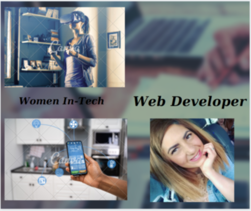

## Hallo, liebe Leute  , I am Beleiu Nicoleta
...

Self-learning Front-end development, eager to become a full-stack developer.

## Skills 

- HTML
- CSS
- Javascript
- React
- Bootstrap
- Ember

Here are some ideas to get you started:

- 🔭 I’m currently working on becoming a Front end Developer
- 🌱 I’m currently learning Javascript and React.JS
- 👯 I’m looking to collaborate on web development project/freelancing/full time job
- 💬 Ask me about front end development 
- 📫 How to reach me: balan_nicky@yahoo.com
- 😄 Pronouns: she/her
- ⚡ Fun fact: I like reading, traveling and making sport. Spending time with my family ❤

